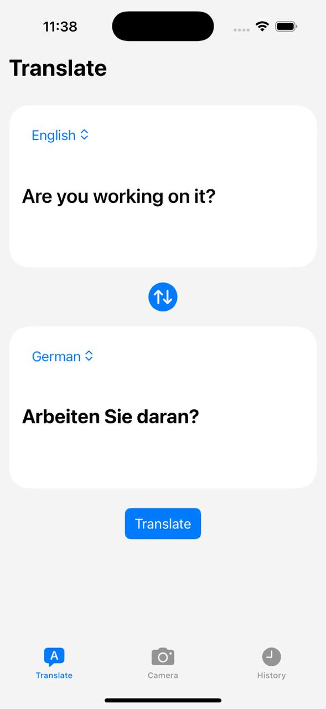

# Translation App - iOS

Real-time text translation iOS application supporting 34+ languages with on-device OCR using Apple's Vision framework.

## ✨ Features

- **34+ Language Support**: Auto-detection and manual language selection (Afrikaans, Albanian, Arabic, Bengali, Chinese, English, French, German, Hindi, Japanese, Korean, Portuguese, Russian, Spanish, Tamil, Telugu, Turkish, Urdu, Vietnamese, and more)
- **On-Device OCR**: Apple Vision framework for real-time text recognition from camera feed
- **Real-Time Translation**: Fast, efficient external API integration
- **Smart History**: View, search, and manage translation history
- **Auto-Language Detection**: Automatically detect source language
- **Camera Integration**: Capture text directly from your surroundings

## 📊 Performance Metrics

The app is optimized for efficient real-time operation:

- **Latency**: 933µs average operation latency
- **Memory**: 56 MB peak memory footprint
- **CPU**: <5% CPU usage at idle
- **Concurrency**: 10,225+ operations handled efficiently
- **Threading**: Robust concurrent architecture with minimal blocking

## 🏗️ System Architecture

### Component Diagram

Shows how the app's major components interact:

- **Translation UI** ↔ **Translation Manager**
- **Camera UI** ↔ **Camera & OCR** (Vision Framework)
- **History UI** ↔ **History Manager**
- **Translation Manager** ↔ **Translation API**


### Package Diagram

Shows the logical organization of the application's modules:

- **Application Layer**: Main app entry point
- **Presentation Layer**: SwiftUI views and view models
- **Translation Module**: Core translation logic
- **Camera Module**: Vision framework integration
- **History Module**: Data persistence and management


### Deployment Diagram

Shows the runtime environment and external communication:

- **iPhone Device**: iOS 15+
- **Translation API Server**: External REST API
- **Communication**: HTTPS/REST protocol


## 📐 UML Design

### Use Case Diagram

Describes the primary interactions between the user and the Translation App, including:

- Select input method
- Enter text manually
- Capture text using the camera
- Select source and target languages
- Translate text
- View translation history
- Manage saved translations


### Class Diagram

Shows the main classes and their relationships within the application, including the UI, translation management, OCR processing, API integration, and history management components.


### Activity Diagram

Shows the end-to-end workflow of a translation request:

1. User selects an input method
2. User chooses camera or manual text input
3. Camera input is processed using OCR, while manual input is entered directly
4. User selects the source and target languages
5. Translation API is called
6. Translated result is displayed
7. Translation is saved to history


### Sequence Diagram

Shows the sequence of interactions during a translation request between the user interface, translation manager, OCR processor, translation API, and history manager.

The sequence includes:

1. User selects an input method
2. User provides input
3. Translation UI requests translation
4. Camera input is processed through OCR when applicable
5. Extracted text is returned to the translation manager
6. Translation API processes the text
7. Translated text is returned
8. Translation is saved to history
9. Result is displayed to the user


## 🛠️ Tech Stack

- **Frontend**: SwiftUI
- **Image Processing**: Vision framework
- **Media**: AVFoundation
- **Architecture**: MVVM with concurrent programming
- **API Integration**: RESTful translation service
- **Language**: Swift

## 📱 Screenshots



## 🚀 Getting Started

### Requirements

- Xcode 15+
- iOS 15+
- Apple Developer Account (for physical device testing)

### Installation

```bash
git clone https://github.com/Pranav-player/Translation.git
cd Translation
open Translation.xcodeproj
